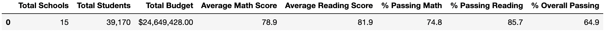
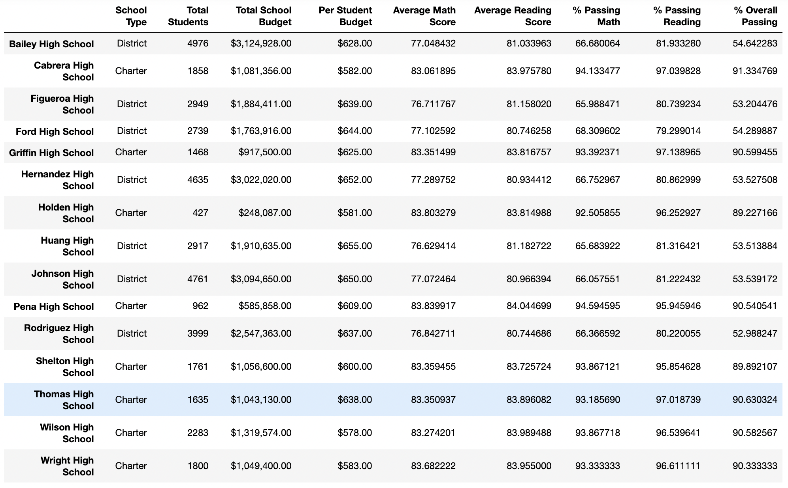
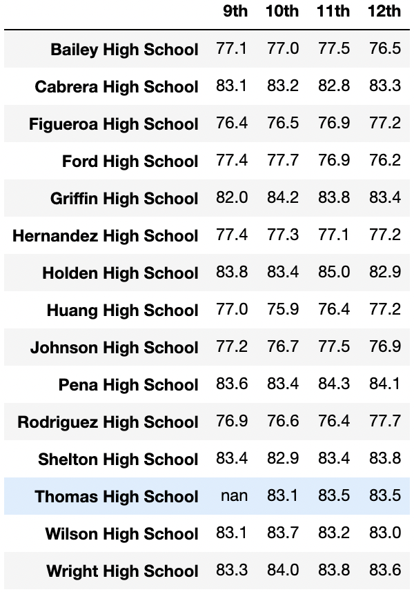
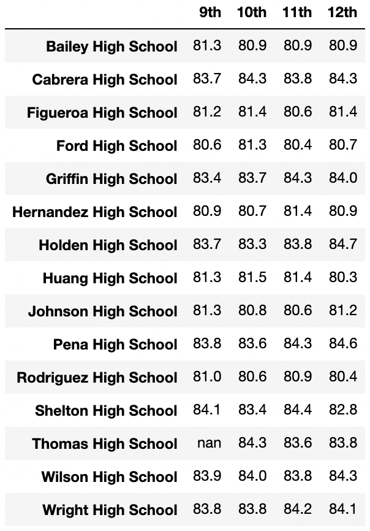

# School_District_Analysis

## Overview of the school district analysis:
A discovery was made that the 9th grade class at Thomas High School had altered their reading and math grades. In order to uphold the academic integrity of the school district it was decided that Thomas High School’s math and reading scores will be replaced with NaNs. All other data for Thomas High School and the other schools will remain the same, and the school district analysis will be conducted again with the NaNs in place.

## Resources:
Data Sources: [students_complete.csv](Resources/students_complete.csv), [schools_complete.csv](Resources/schools_complete.csv)\
Software: Jupyter Notebook 6.1.4 

## Results:
- How is the district summary affected? The district summary saw a decrease in the average math score (-.1%), % passing math (-.2%), % passing reading (-.1%), and % overall passing (-.3%). Both new and old district summaries are below. 

### New District Summary

### Old District Summary

- How is the school summary affected? The school summary was affected for Thomas High School only. The values for % passing math, % passing reading, and % overall passing was updated to reflect the new values without the 9th grade classes’ scores. 

 - How does replacing the ninth graders’ math and reading scores affect Thomas High School’s performance relative to the other schools? Thomas High School’s performance increased significantly after the scores were replaced. The overall passing percent with the 9th graders’ scores was 65%. After the scores were removed the overall passing percent was 90%, putting Thomas High School as the second highest school in the district by overall passing percent. Thomas High School’s percent passing reading increased from 69% to 97%, and the 3rd highest school in the district by reading passing percent. The percent passing math increased from 66% to 93%, and the 7th highest school in the district by math passing percent.

- How does replacing the ninth-grade scores affect the following:
  - The only effect replacing the 9th grade scores had on the math and reading scores by grade was that Thomas High School now shows nan for their 9th grade math       and reading scores (see images below).   
  - The scores by school spending were not affected by this change 
  - The scores by school size were not affected by this change
  - The scores by school type were not affected by this change

### Math Scores by Grade 
 
 
### Reading Scores by Grade 

 
 ## Summary: 
The first major change in the updated school district analysis is the decrease in the average math score, % passing math, % passing reading, and % overall passing for the entire school district. Since we removed the entire Thomas High School 9th grade classes’ reading and math scores it was to be expected to see a change in the district summary, albeit very minimal. The second major change was the overall passing percent for Thomas High School, which increased from 65% to 90% after the 9th grade classes’ scores were removed. For the third major change, we saw Thomas High School’s math passing percent increase from 66% to 93%. And finally, the last major change was Thomas High School’s reading scores increased from 69% to 97%.   
